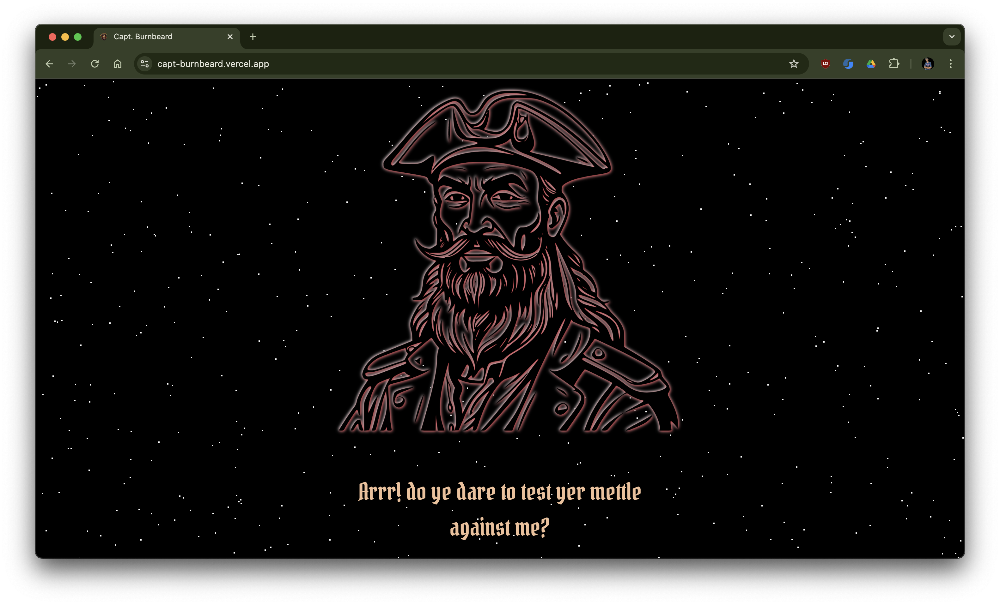
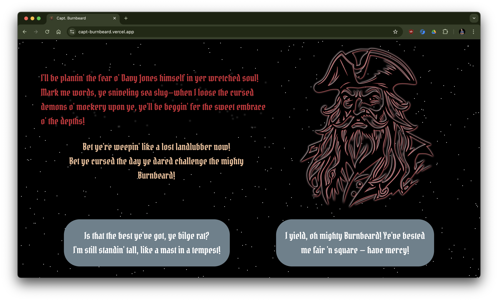

# Captain Burnbeard's Roasting Ship

Ahoy, matey! Welcome aboard Captain Burnbeard's Roasting Ship, the most entertaining Next.js app on the high seas! Powered by the mighty Gemini AI, this app will roast you based on the characteristics you enter. Prepare to be roasted, ye scallywag!

## Live Demo: [Captain Burnbeard's Roasting Ship](https://capt-burnbeard.vercel.app/)

## Screenshots




## Features

- **Next.js Framework**: Built with the powerful and flexible Next.js framework.
- **Gemini AI**: Our secret weapon, Gemini AI, delivers the wittiest and most cutting-edge roasts.
- **Pirate Themed**: Avast! Enjoy a fully immersive pirate experience.
- **Customizable Roasts**: Enter yer characteristics and let the AI do the rest.

## Getting Started


1. **Clone the repo**:
    ```bash
    git clone https://github.com/Agrim-Bansal/captburnbeard.git
    cd captburnbeard
    ```

2. **Install dependencies**:
    ```bash
    npm install
    ```

3. **Run the development server**:
    ```bash
    npm run dev
    ```

4. **Open your browser** and navigate to `http://localhost:3000` to start getting roasted!


## Usage

1. **Enter yer characteristics**: Scroll down and fill out some of your details.
2. **Get roasted**: Click the button and brace yerself for the AI's witty banter.


This app is for entertainment purposes only. If you can't handle the heat, stay outta me deck!
Fair winds and following seas, to you sailor!
